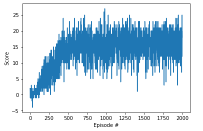
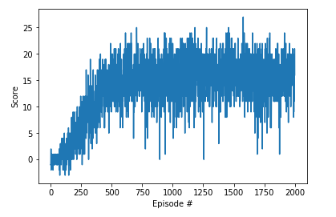

# Udactiy Reinforcement Learning Nanodegree Project 1 - Banana Collector

## Project Details
### Environment
Goal: Collect as many yellow bananas as possible <br>
Observations: <br>
Actions: 4(Move Forward, Move Back, Rotate Left, Rotate Right)<br>
Rewards: +1 on collision with yellow banana, -1 on coliision with purple banana <br>

### Requirements
- Udacity Banana Environment
- Pytorch
- numpy
- jupyter notebook

### Instructions
open [Navigation.ipynb](Navigation.ipynb) in web browser by jupyter notebook. run the all cells for learning from scratch. If you want to load pre-trained weights. uncomment below cell.
```python
agent = Agent(state_size, action_size, 1000)

# if you want to load checkpoint
# agent.qnetwork_local.load_state_dict(torch.load("checkpoint.pth"))
# agent.soft_update(agent.qnetwork_local, agent.qnetwork_target, 1)
```

## How I train a agent?
### DQN(Deep Q-Network)
Deep Q-Network implement Q-Learning by Neural Network. I implemented neural network by pytorch.
```python
class DQN(nn.Module):
    """Actor (Policy) Model."""

    def __init__(self, state_size, action_size, seed, fc1_units=64, fc2_units=64, dropout_rate=0.1):
        super(DQN, self).__init__()
        self.seed = torch.manual_seed(seed)
        self.fc1 = nn.Linear(state_size, fc1_units)
        self.fc2 = nn.Linear(fc1_units, fc2_units)
        self.fc3 = nn.Linear(fc2_units, action_size)
        
        # 37 -> fc1 -> fc2 -> 4

    def forward(self, state):
        """Build a network that maps state -> action values."""
        x = F.relu(self.fc1(state))
        x = F.relu(self.fc2(x))
        return self.fc3(x)
```

model contains 3 Fully-connected layers. first and second layer is followed by relu actiovation function.

### Experience Replay with Replay Buffer
Experience Replay is that save the experience(states, actions, rewards and next states in episodes) to Replay buffer. Therefore get a random samples to learn from saved experience. So we can learn the agent from much more experiences.

### Fixed Q-Target
In DQN, Q-Target is also estimated by same network. If I update the network to correctly expect the action-value, action-value has changed because Q-Target also changed. To prevent this, we distinquish target network and local network(action-value function). And update target network for every few steps. You can see the codes in Agent.learn() function.

### Double DQN
Double DQN, uses local network determine next state action and estimates that action's value from target network. Because initially DQN has lower accuracy so that follow the agent to wrong way. By using Double DQN, our local network has a role of determine target network

```python
next_actions_by_local = self.qnetwork_local(next_states).detach().max(1)[1].unsqueeze(1)
# [batch, actions]
Q_targets_next = self.qnetwork_target(next_states).detach().gather(1, next_actions_by_local)

# Compute Q targets for current states 
Q_targets = rewards + (gamma * Q_targets_next * (1 - dones))

# Get expected Q values from local model
Q_expected = self.qnetwork_local(states).gather(1, actions)

# Compute loss
loss = F.mse_loss(Q_expected, Q_targets)
```


## Final Agent Achievement
No. Episodes: 2000<br>
Final Average Score: 15.8<br>
Model Checkpoint: temp-checkpoint.pth<br>

### Scores Graph 
#### DDQN


Saved Model: [ddqn.pt](ddqn.pt)

#### compare with DQN


Saved Model: [dqn.pt](dqn.pt)

DDQN converges little faster than DQN, also shows more stable graph than DQN.